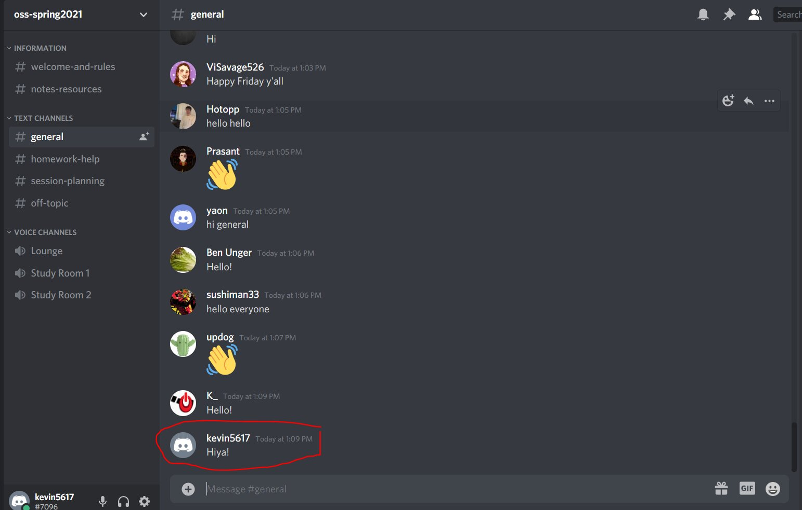
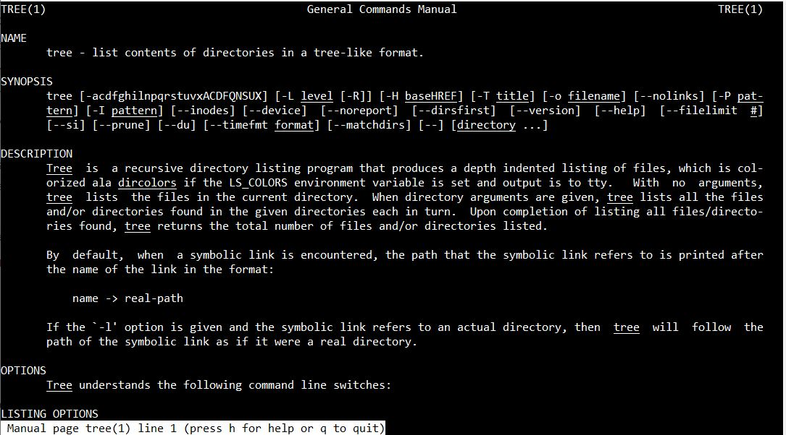
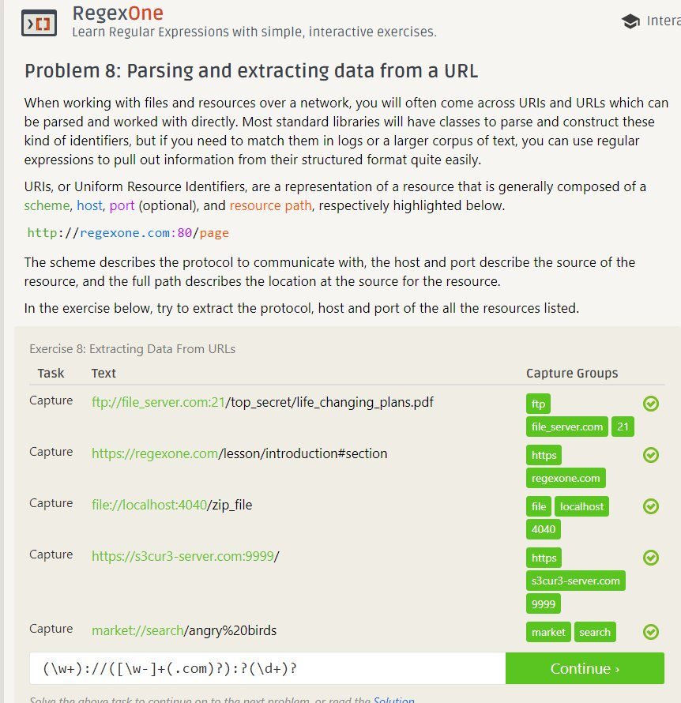
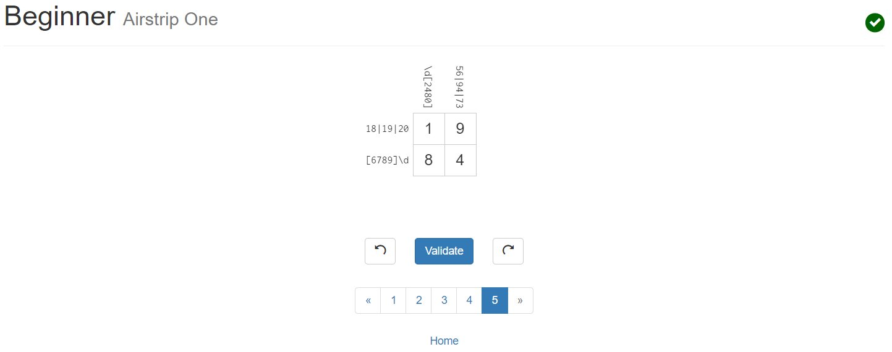
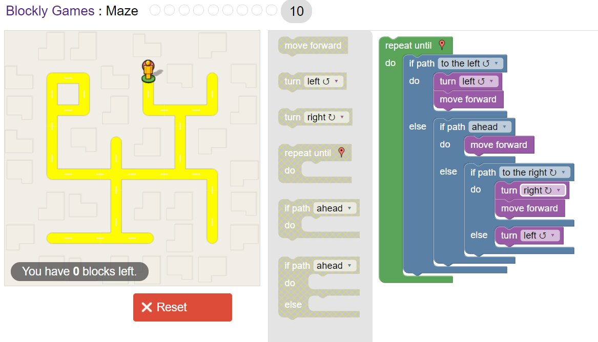

# Lab 01 Report - Introduction to Open Source Software

### Kevin Boyle

### Discord: kevin5617

  

## Selfie!

  

## Discord Message!

  

## Better ways to answer a question

1. _Provide other examples_: If someone is asking how a piece of code/function would work, providing other examples has seemed to help me and other people greatly when trying to understand a concept.

2. _Ask what is supposed to happen_: If you are trying to help someone through a bug or strange problem, make sure you understand what is supposed to be happening before giving back suggestions, because if you don't understand what you're supposed to do, then your help isn't needed.

  

## Response to Free Culture

My initial reaction to reading the story about Jesse Jordan is that developing network software can be scary and dangerous. When working with software that can connect millions of devices, security and safety is imperative. There are many protocols you have to follow, that they can be broken even accidentally, as seen with Jesse. While I understand the anger by the RIAA, I would almost be impressed at a relative "rookie" in the programming world setting up an entire peer-to-peer file sharing network. A lesson should be made to him that what he did was "cool", but likely illegal. That seems to be what happened, as the degree to which the RIAA was suing him was rather extreme compared to their revenue. However, Jesse did in fact win, and probably proved a point to the corporate world that a new fold in the copyright landscape emerged. While that type of network to share music without buying likely should not exist, it does introduce questions about the legality. One could give a record or CD to their friend, so fundamentally what is different about sharing a music file. Yes it is duplication, but they are somewhat the same idea.

  

## Tree Example

  

## 7 Regex Problems Completed

  

## 5 Regex Crosswords Completed

  

## Blockly Puzzle Completed

  

## Open Source Project Ideas

Although I currently accepted a full-time position for after graduation, I think having a personal website that can speak for itself in terms of skills. By that I mean I think I would like to construct my own personal website with resources like React. On the actual website I would plan to explain some of the projects I've worked on inside/outside school. To allow this project to be used by others, I think templating the project in another git branch could be helpful, so people could use a blank slate.