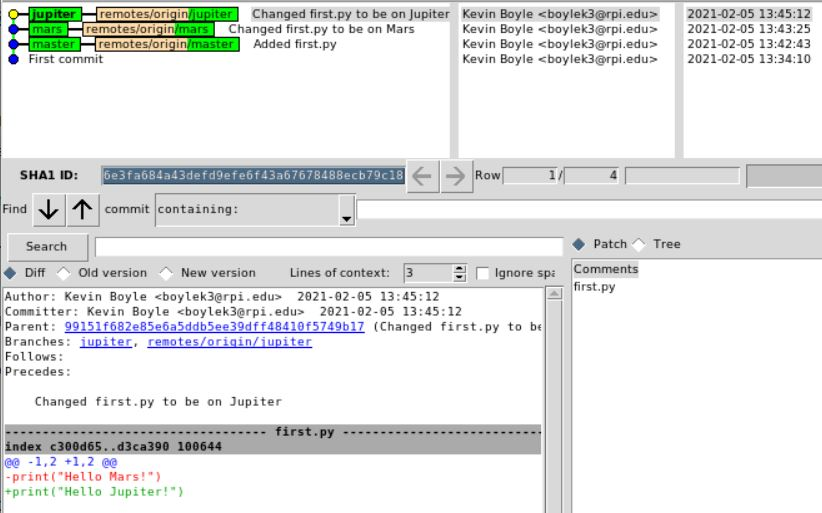
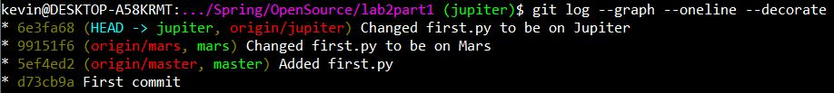
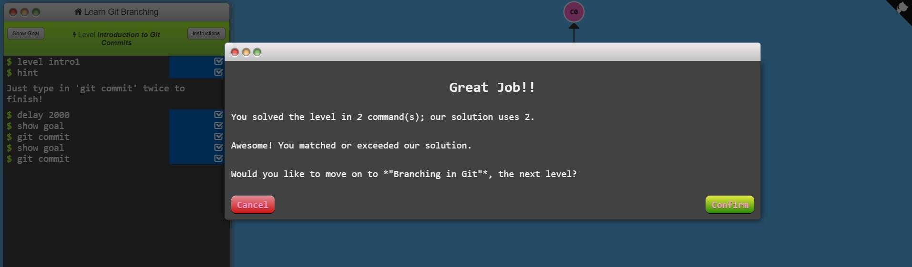
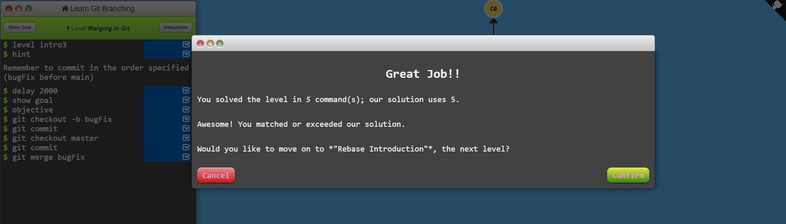
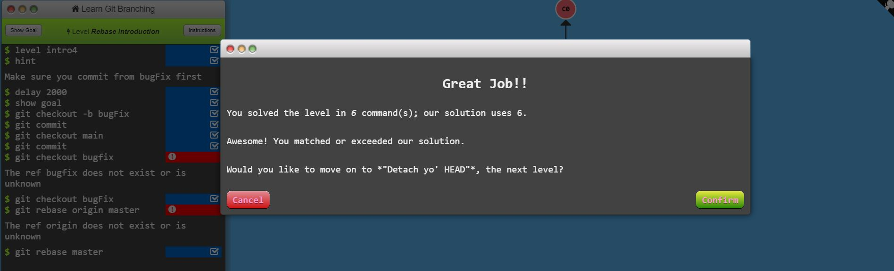
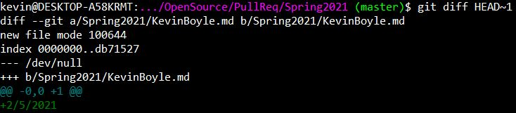
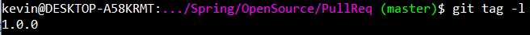

## Part 1

https://github.com/kevinb5617/lab2part1

gitk definitely provides more useful information than the command line tool.

## Part 2

https://github.com/kevinb5617/Spoon-Knife

## Part 3

https://github.com/kevinb5617/PullReq

