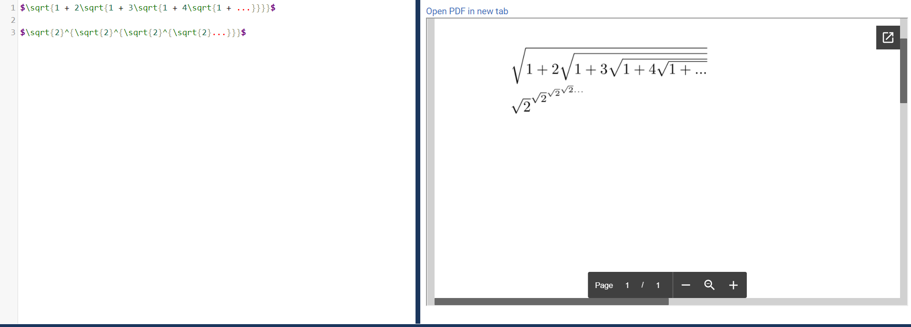
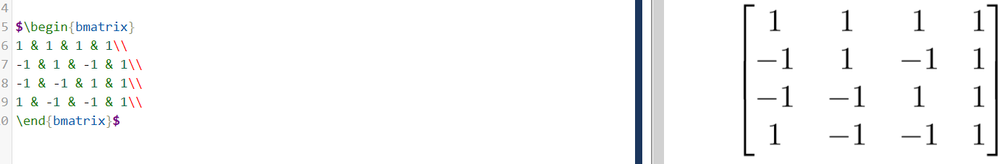
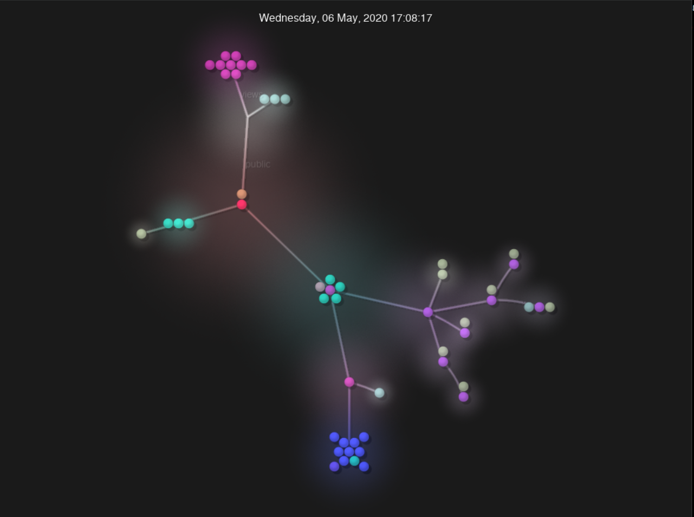
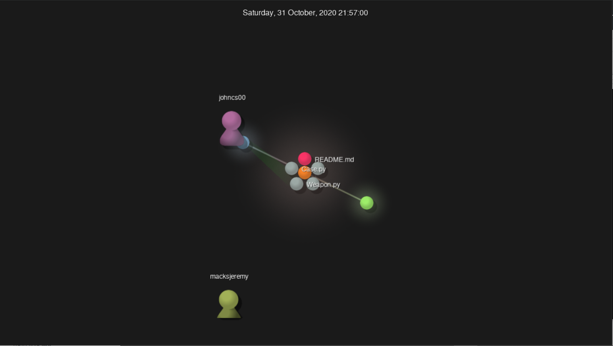
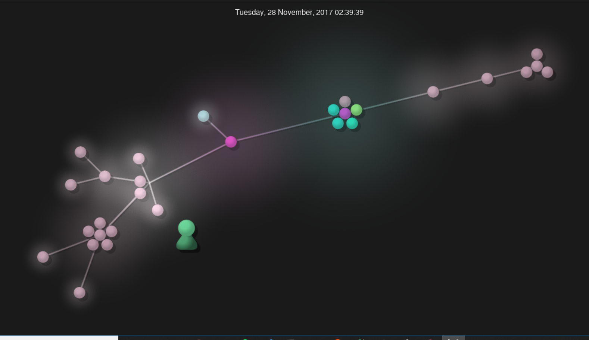
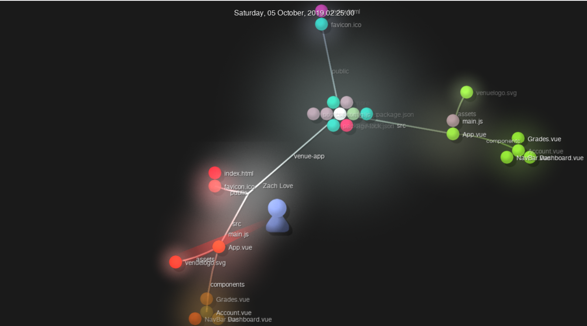

# Part 1

[Wiki Page](https://github.com/kevinb5617/oss-kb/wiki/Lab-3-Project-Brainstorming)

# Part 2

## RPI CampusMap

* 12 Contributors
* 37207 lines of code
* Initial commit: ["Initial commit"](https://github.com/gaskij/rpicampusmap/commit/5addd28)
* Latest commit: ["Merge pull request #153 from gaskij/dependabot/npm_and_yarn/campusmap/axios-0.21.1"](https://github.com/gaskij/rpicampusmap/commit/2b735c7)
* Branches
    * master
    * readmeupdate
    * bugfix/update-leaflet
    * docs/cas
    * feature/auth-context
    * feature/login_page
    * dev
    * live_location_tracking
    * feature_prof_search
    * legacy
    * feature/comment-api

### gitstats
* Lines: 21118
* Authors: 18

---

## RCOS Project: SMAB

* Number of Contributors: 2

* Number of Lines of Code: 1606

* First Commit: 9/18/20 "Initial commit" here

* Latest Commit: 12/09/20 "Update README.md" here

* Current Branches: There are 5 current branches (master, URLtraverseandJSON, User-Interface, Class-Files, and rmupdate)

* Gitstats says there are 1590 lines of code and 4 contributors

---

## OpenCircuits

* 33 contributors
* 26796 lines of code
* First commit: https://github.com/OpenCircuits/OpenCircuits/commit/c4a9e7d66d32391f9371a68a0749588a6218b5b3
* Last commit: https://github.com/OpenCircuits/OpenCircuits/commit/33296784ecf4fabf6b2439e04540049b15fcb26a
* Branches: origin/AnalogWork origin/Browser-compatibility-(version,-etc.) origin/Documentation origin/HEAD -> origin/master origin/ICLibrary origin/MUXLabel origin/MainTutorial origin/Optimizations origin/PlaceComponentFix origin/Replace_Component origin/SelectionToolTest origin/Snap_Options origin/TashBranch origin/UnitTests origin/VideoTutorialPage origin/all origin/db-versioning origin/expression-to-circuit origin/master origin/port-8081
* Gitstats says there is only 26335 lines of code

---

## Venue Project:
* 16 Contributors
* 562692 Lines of code
* First Commit with hash 59b0b87b05395211b2d69de63f5c7664594ec17b
* Latest Commit with hash 72f0929bc9584b08c2e9e036b58e0c7f4117d631
* The current branches are: dependabot/npm_and_yarn/axios-0.21.1 dependabot/npm_and_yarn/server/date-and-time-0.14.2 course_overview snooze agreement notification engagements multiselect SVG-Icons minn_fixes better-dashboard organizations stats uml new_course_fix ethanfixes dark_mode drop_down_modulation course_settings clipboard
* Gitstats: The number of lines reported by gitstats is substaintially lower than that from the command line
* It also reported 25 authors compared to the 16 on the repo.

---
