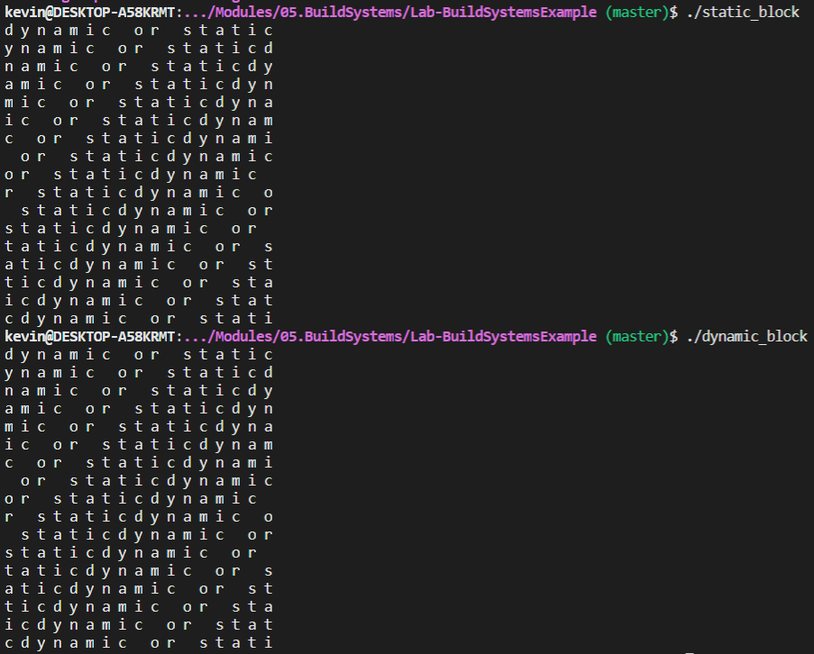
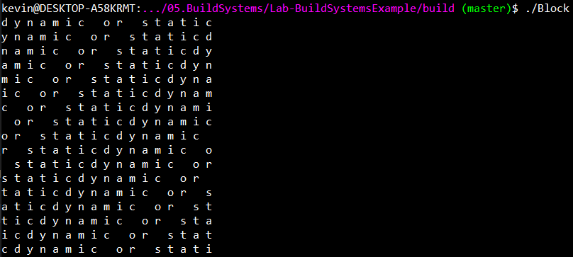
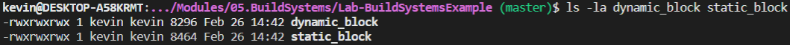

# Open Source Software Lab 5

For the first part of the lab, I have all of the steps from the cmake tutorial (steps 1-5) [here](https://github.com/kevinb5617/oss-kb/tree/master/labs/lab-05), within their respective directories [step1](https://github.com/kevinb5617/oss-kb/tree/master/labs/lab-05/step1), [step2](https://github.com/kevinb5617/oss-kb/tree/master/labs/lab-05/step2), [step3](https://github.com/kevinb5617/oss-kb/tree/master/labs/lab-05/step3), [step4](https://github.com/kevinb5617/oss-kb/tree/master/labs/lab-05/step4), and [step5](https://github.com/kevinb5617/oss-kb/tree/master/labs/lab-05/step). In each directory is the associated CMakeLists.txt file(s) and screenshots of the working output.

---

For the second part of the lab, I included my static/shared libraries [Makefile](https://github.com/kevinb5617/oss-kb/tree/master/labs/lab-05/final/Makefile), cmake-generated [Makefile](https://github.com/kevinb5617/oss-kb/tree/master/labs/lab-05/final/cmake/Makefile), and [CMakeLists.txt](https://github.com/kevinb5617/oss-kb/tree/master/labs/lab-05/final/CmakeLists.txt). Lastly, I have several photos showing the output of the static/shared library output, and the same program built with cmake.

---

## Output using static/shared libraries

---

## Output using cmake executable

---

## Comparing size of static/dynamic executables
