# Checkpoint 1

Below is a screenshot of `cmake-gui` successfully configuring and generation of the cmake build files.

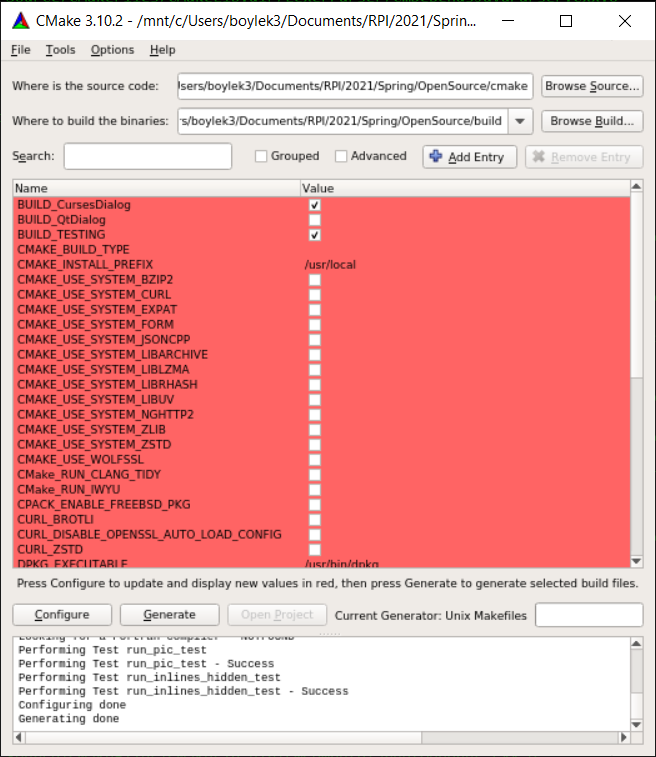

Below is a screenshot of running `make -j4`, building the system successfully.

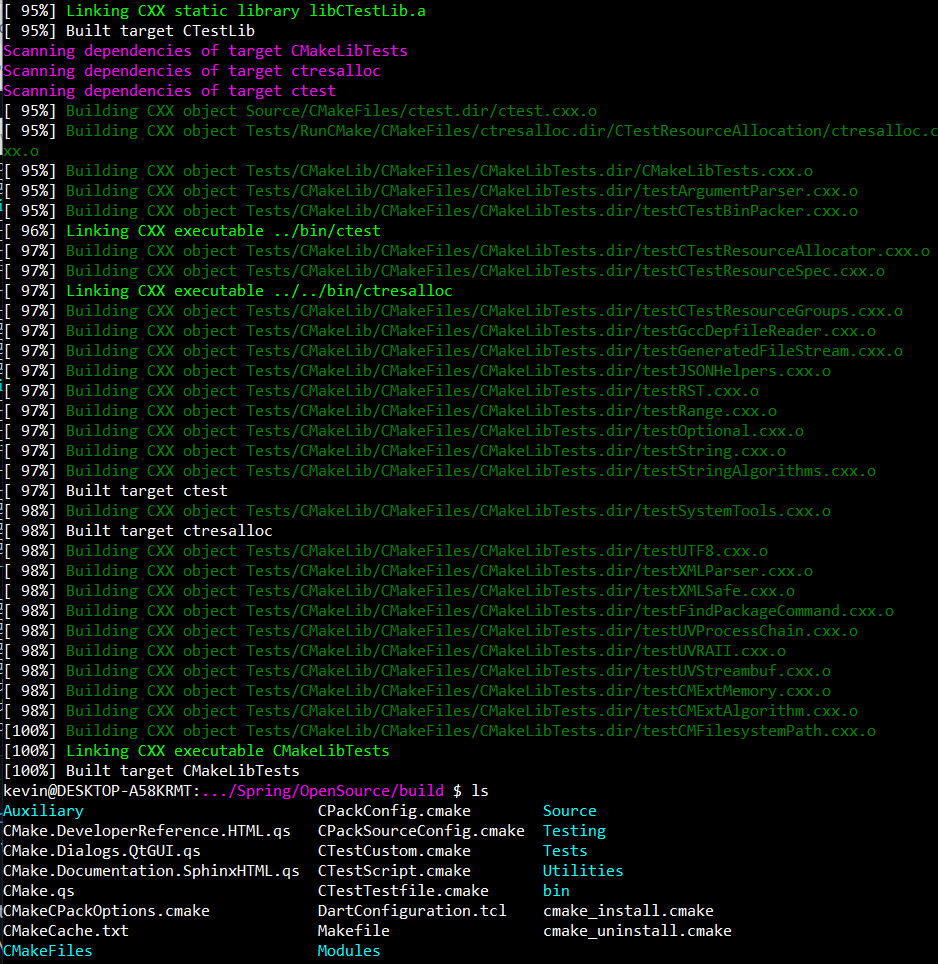

# Checkpoint 2

1. Under the Nightly/Experimental sections, you can click on a given "Build Name", and after scrolling all the way to the bottom, you can see how many tests passed/failed and click "View Tests Summary" to see all tests. In [this](https://open.cdash.org/test/371945905) test, you can see the command that was run, actual `stderr` vs. expected `stderr` to hopefully debug what went wrong. There is [this](https://open.cdash.org/build/7072802) build, which seems to be a similar architecture as what I am running. It is on an Ubuntu 18.04 system, and I am running the Ubuntu 18.04 LTS "shell" on Windows. For the aforementioned build, its failed test is a warning saying that a certain flag is deprecated, which could cause issues in future versions. However, this doesn't seem to be a critical test failure. The dashboard is fairly clean with graphs and links to the specific tests, but the configure output taking up so much space is a little annoying.

2. After running the tests locally, only one test failed. As seen in the photo below, my build appears on the cdash website. The test that failed, though, was the [kwsys.testSystemTools](https://open.cdash.org/test/372134066) test. I noticed another student's (Christine Koulopoulos) [test](https://open.cdash.org/viewTest.php?buildid=7124783) had the same results, and I know we are both running the Ubuntu 18.04 LTS from the Windows store. Additionally the test failure just says there's an issue with a file's permissions, which likely wasn't broken by any messed up previous step. There is also a screenshot of the specific failed test output below.

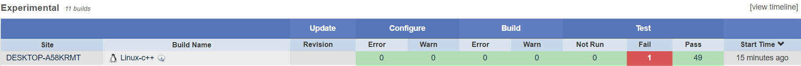
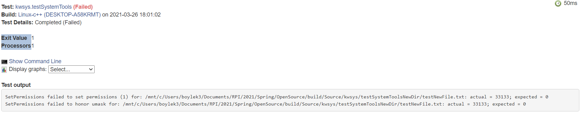

# Checkpoint 3

After modifying the cmake/Copyright.txt file, a new test fails. When looking at the test results [here](https://open.cdash.org/test/372640584) on the cdash website, the error says that the Copyright is valid from 2000-2020, but it is 2021.

Below is a screenshot of the new build after modifying Copyright.txt

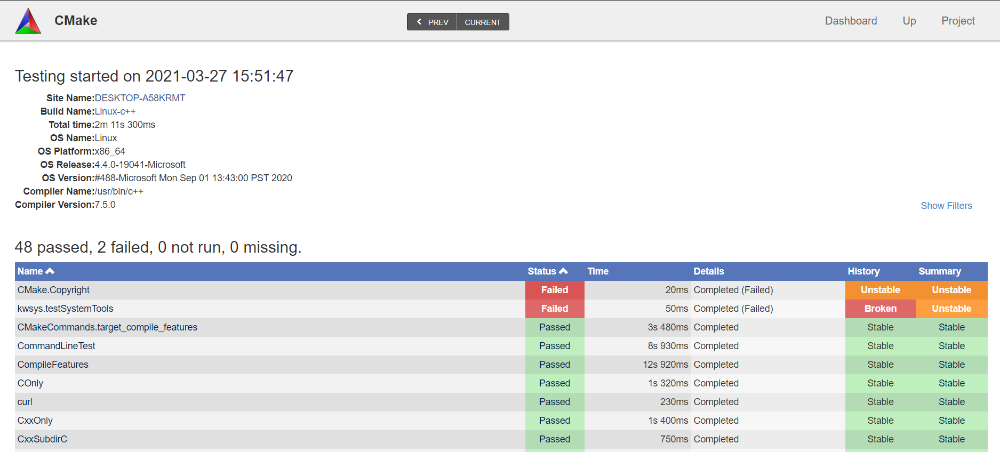

Below is a screenshot of the failed copyright test

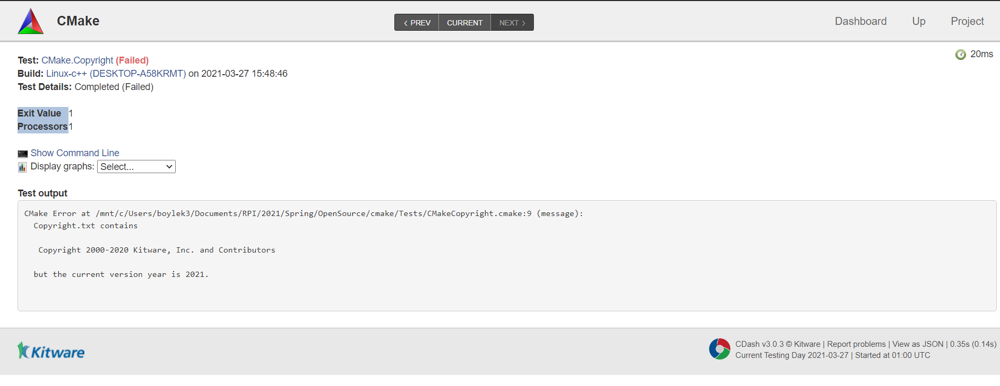

After fixing the year in the copyright file to 2021, it now looks like the following

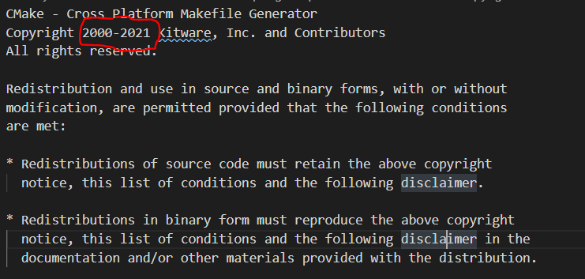

Below is the result of running the tests again, which shows the working Copyright test

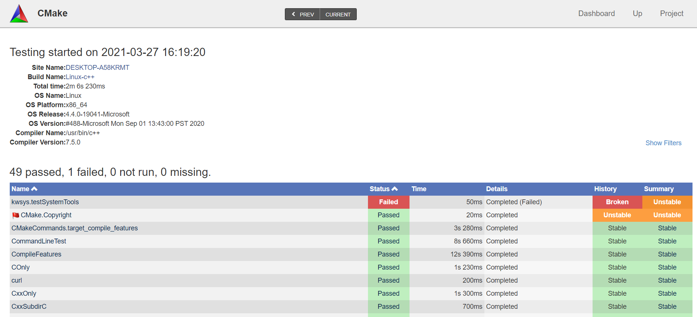

# Checkpoint 4

The link to my repository where I created the GitHub action/workflow for CMake is [here](https://github.com/kevinb5617/cmake_cicd).

Below is a screenshot of the pull request I created showing the two successful workflows for push/pull request

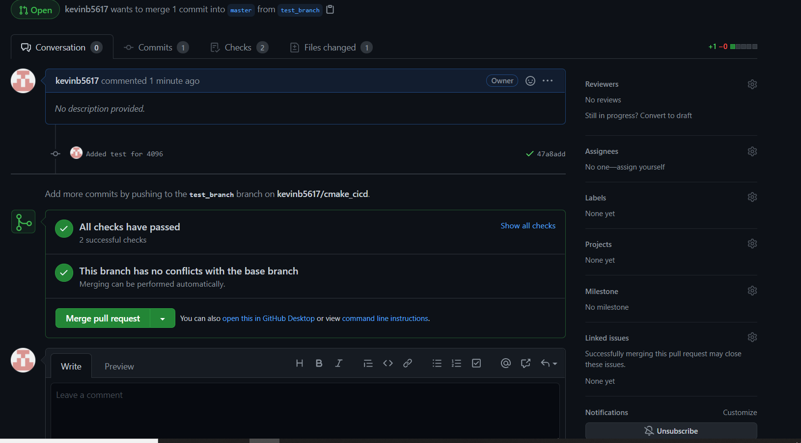

Below is a picture of the two workflows succeeding

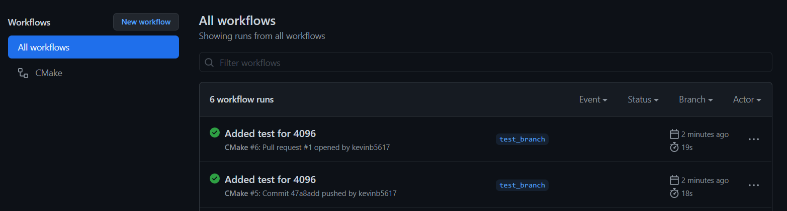

Below is the test output of the workflows showing the 4096 test succeeded.

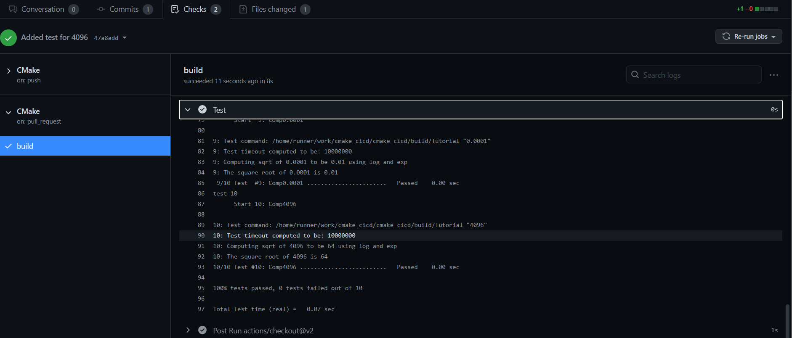

# Checkpoint 5

ResuMake

http://rcos.io/projects/kevinb5617/resumake/

https://github.com/kevinb5617/ResuMake

https://rcos.io/projects/kevinb5617/resumake/blog

Kevin Boyle, Christine Koulopoulos, Zachary Koo, Lillian Beals