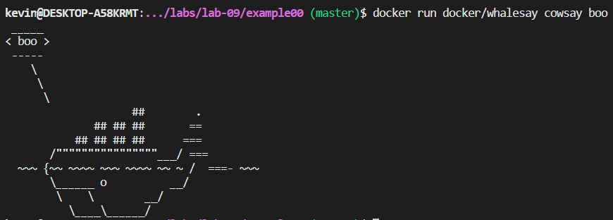
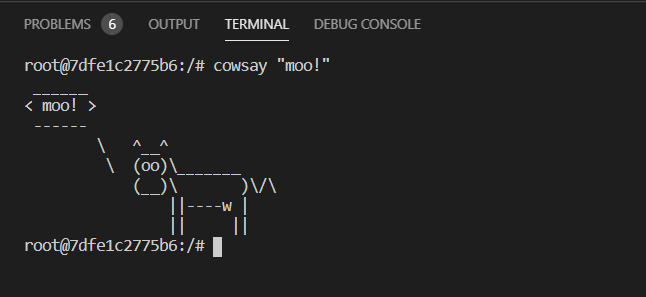
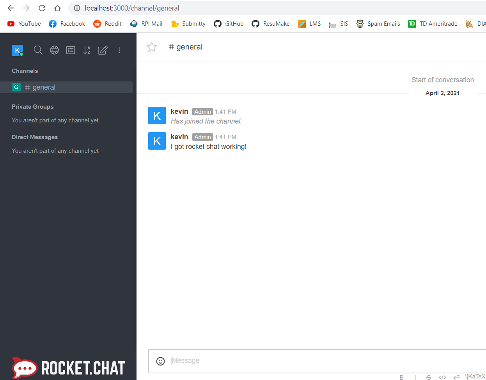
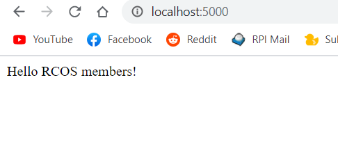
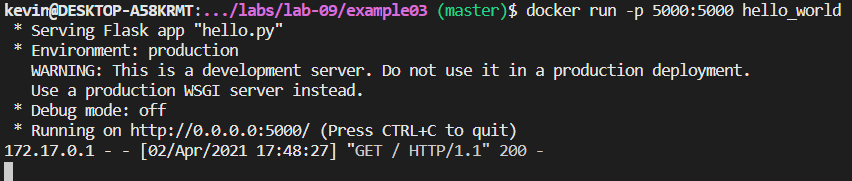
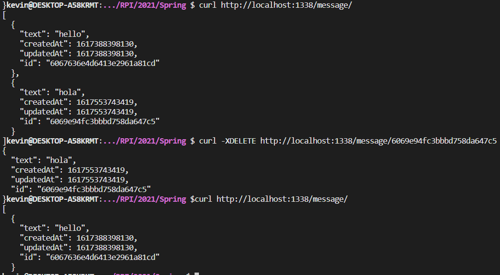

## Example 0

After getting the docker/whalesay image running, the following output was produced

---

## Example 1

Similarly, after running the Ubuntu image and getting access to the bash shell to install "cowsay", the following output was produced

---

## Example 2

I was able to start the RocketChat and mongodb images simultaneously, allowing me to access RocketChat at `localhost:3000`

---

## Example 3

After running the Dockerfile, which starts a Python container, I could access the "hello world" program on my browser, and see the GET request in the terminal.

---

## Example 4

Finally, with the last example, I had to change the port mapping from `1337:1337` to `1338:1337` (1338 on host to 1337 on container) since port 1337 was busy on my computer. Although after filling out the docker-compose and Dockerfile, I started the "messageApp" container, and could perform the GET/POST/DELETE requests.

