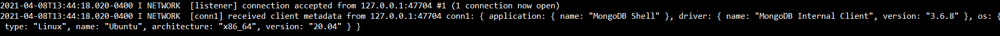
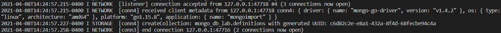
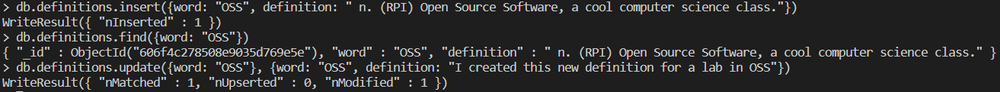
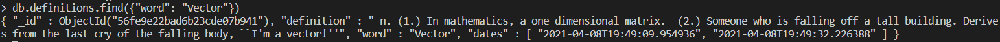

## Checkpoint 0

The Supreme Court ruling on the "copyright-ability" of APIs brings forth an interesting discussion. One perspective, which the Supreme Court seemed to stress, was that the APIs Google recreated from Oracle were rather barebones or could not really be created in a different way. If some of those APIs contained the most basic read/write functionality to interact with the Java Virtual Machine, I would assume there is not really another way to go about that process. In those cases, I agree with the ruling: those APIs should not be under copyright. An opposing argument is that even open access to these APIs could prove to be a security issue. If APIs are released under very "liberal" licenses, it may allow outside developers to analyze the different services the API interacts with. This could become an issue with API software for banking systems, for example. Having a blanket copyright classification likely isn't the best solution. Leaving it to the original developers to decide on an open source license seems to be the best course of action.

## Checkpoint 1

Below is the output from the `mongod` instance, showing the connection made locally.

---

## Checkpoint 2

Below is a screenshot of the "creation" of the collection with the definition data:

---

## Checkpoint 3

`db.definitions.find()`: This seems to just get all the "definitions" documents as JSON objects.

`db.definitions.findOne()`: This command gets the first definition in the data set.

`db.definitions.find({word: "Capitaland"})`: This gets the JSON object whose word field matches "Capitaland"

`db.definitions.find({_id: ObjectId("56fe9e22bad6b23cde07b8ce")})`: This gets the JSON object whose _id field matches 56fe9e22bad6b23cde07b8ce

Below is a screenshot of me entering a document for the word "OSS" and find()-ing it.

For some reason, when running `git diff` there seems to be a lot more differences than just my insert/update. It seems like the order of the documents is the difference. You can see the diff output [here](diff.txt). At the very bottom of the diff is the entry I created.

---

## Checkpoint 4

The file [here](mongodb_lab/checkpoint4.txt) has the output of running the [checkpoint4.py](mongodb_lab/checkpoint4.py) file to test the find all, find_one, find a specific record, find a record by id, and insert operations in `pymongo`.

---

## Checkpoint 5

The screenshot below is the first record that was randomly updated twice by [checkpoint5.py](mongodb_lab/checkpoint5.py). As you can see, the dates array has 2 timestamps.

