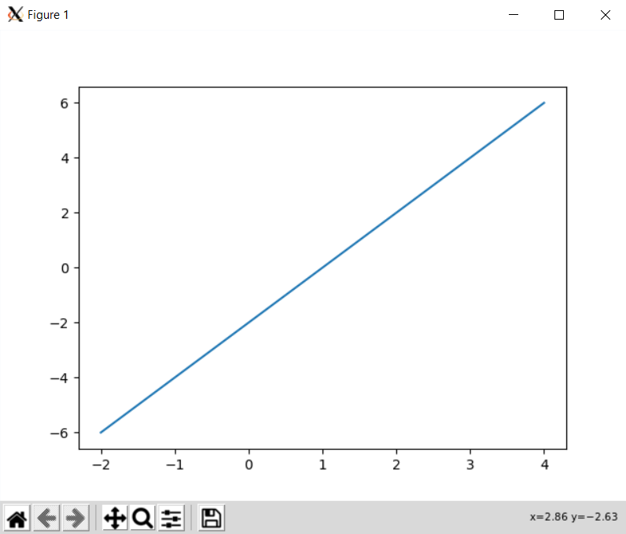
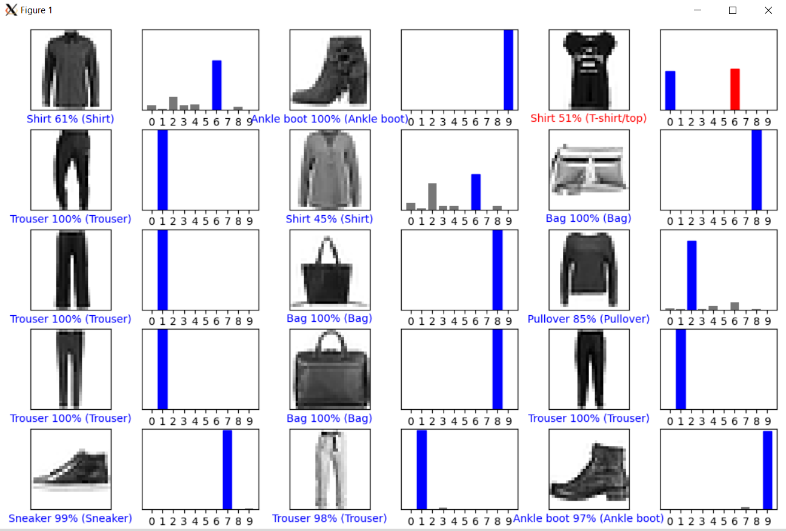
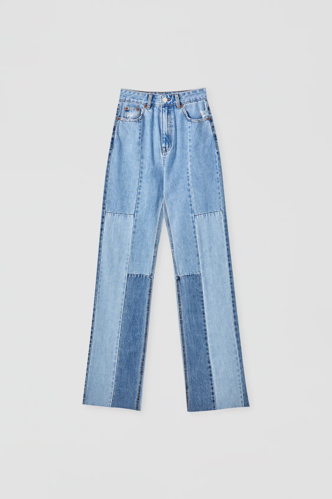
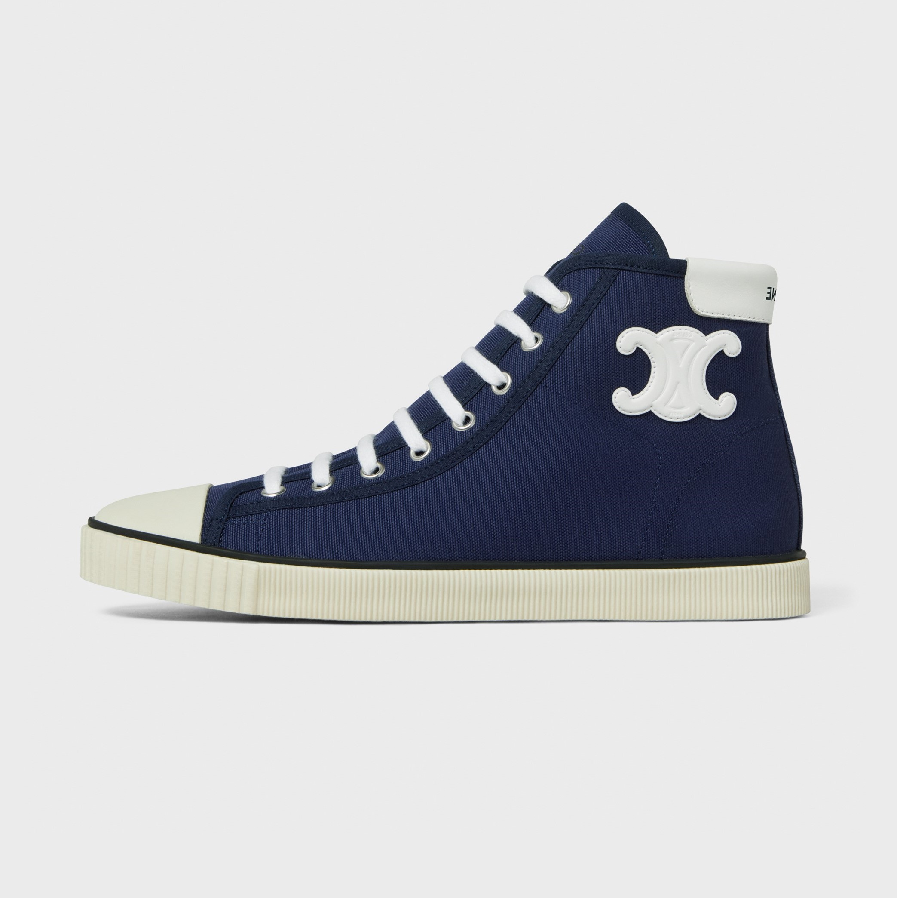
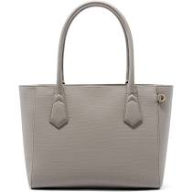
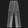
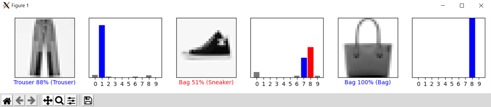

## Checkpoint 1

The following picture is a simple plot with `matplotlib`



## Checkpoint 2

For this checkpoint, I modified the given code block into the one below, which now pulls out the prediction results for test images 9000-9014.

```python
# Plot the first X test images, their predicted labels, and the true labels.
# Color correct predictions in blue and incorrect predictions in red.
num_rows = 5
num_cols = 3
num_images = num_rows*num_cols
plt.figure(figsize=(2*2*num_cols, 2*num_rows))
for i in range(9000, 9015):
  plt.subplot(num_rows, 2*num_cols, 2*(i-9000)+1)
  plot_image(i, predictions[i], test_labels, test_images)
  plt.subplot(num_rows, 2*num_cols, 2*(i-9000)+2)
  plot_value_array(i, predictions[i], test_labels)

plt.tight_layout()
plt.show()
```

The resulting plot is shown below.



## Checkpoint 3

I used the following 3 original images

  

After scaling them down to 28x28, making them grayscale, and inverting them, they look like the following

  

Finally, after running these through the model, the prediction plot is shown below:



It was able to recognize the jeans and bag pretty closely, although the sneaker was wrong. The next closest guess was sneaker, but I think the discrepancy could have been from any white in the shoe, in particular, towards the top, which made it appear to have a handle like a bag.